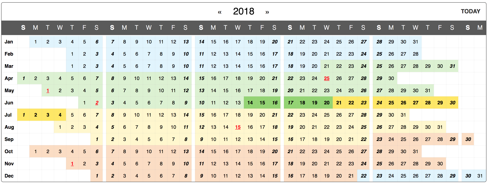

# React-yearly-calendar-ts

[React](https://facebook.github.io/react/) calendar component with yearly view.

# Note! This is a fork. The original project was created by awesome people at BelkaLabs.
Original project found here: https://github.com/BelkaLab/react-yearly-calendar

This fork contains a few fixes:

✔ Rewritten in functional components<br/>
✔ Rewritten in TypeScript<br/>
✔ Removed moment.js dependency and replaced with day.js<br/>
✔ Added locale support<br/>
✔ Added better mobile support




# Install
```bash
$ npm install react-yearly-calendar-ts
```

# Demo
**[http://belkalab.github.io/react-yearly-calendar/](https://belkalab.github.io/react-yearly-calendar)**


Or taste an example usage below:
```js
var ReactDOM = require('react-dom');
var {Calendar, CalendarControls} = require('react-yearly-calendar');

function onDatePicked(date) {
  alert(date);
}

ReactDOM.render(
  <Calendar
    year={2018}
    onPickDate={onDatePicked}
  />,
  document.getElementById('calendar')
);
```

## Options

#### Calendar

| Prop | Type | Description | Default |
|------|------|-------------|---------|
| **year** | React.PropTypes.number.isRequired | year to be displayed | current year |
| selectedDay | moment.js object | selected day | today |
| forceFullWeeks | React.PropTypes.bool | match calendar row end with row start | false |
| showDaysOfWeek | React.PropTypes.bool | show table header with days of week | true |
| showWeekSeparators | React.PropTypes.bool | shows a blank column between one week and another | true |
| firstDayOfWeek | React.PropTypes.number | select first day of week | 0 (Sunday) |
| selectRange | React.PropTypes.bool | enable selecting ranges | false |
| selectedRange | `[moment.js obj, moment.js obj]` | selected range of dates in the form `[start, end]` | |
| customClasses | React.PropTypes.object, React.PropTypes.func | custom days/periods coloring (see section below) | |
| titles | React.PropTypes.func | function mapping dates to html titles | |

#### CalendarControls

| Prop | Type | Description | Default |
|------|------|-------------|---------|
| **year** | React.PropTypes.number.isRequired | current year number | current year |
| showTodayButton | React.PropTypes.bool | show *Today* button on top left | true |


## Callbacks

#### Calendar

| Prop | Type | Syntax | Description |
|------|------|--------|-------------|
| onPickDate| React.PropTypes.func | function(selectedDay, dayClasses) {} | called when user clicks on a day. `dayClasses` is a string representing the classes applied to that day |
| onPickRange| React.PropTypes.func | function(rangeStart, rangeEnd) {} | called when user selects a range of dates (only in `selectRange` mode) |

#### CalendarControls

| Prop | Type | Syntax | Description |
|------|------|--------|-------------|
| onPrevYear| React.PropTypes.func | function() {} | called on user clicking `«` (*previous year button*) |
| onNextYear| React.PropTypes.func | function() {} | called on user clicking `»` (*next year button*) |
| goToToday| React.PropTypes.func | function() {} | called on user clicking the `today` button |

## Styling guide
The calendar is rendered as an html `table` element, to ensure proper displaying even in case the style isn't being loaded.

Take a look at the css file in [`examples/basic/src/style.css`](https://github.com/BelkaLab/react-yearly-calendar/blob/master/examples/basic/src/style.css). Here are some head-ups if you want to style it yourself.

 - `table.calendar`: the main element that renders the calendar
 - `table.calendar thead`: renders the week day names
 - `table.calendar thead th.bolder`: adds `bolder` class to Sundays
 - `table.calendar td.month-name`: first column in table body, showing month names
 - `table.calendar td.prev-month`, `table.calendar td.next-month`: classes applied to the days of the previous and next month showed in a month's row to fill it up. Day numbers and callbacks are present even in these cells, so we suggest to play with text color to make days less intrusive and add `pointer-events: none` to prevent clicking.
 - `table.calendar td.week-separator`: class applied to table cells used to separate one week from another. As above, `pointer-events: none` is suggested
 - `table.calendar td.selected`: the currently selected day
 - `table.calendar td.bolder`: the days which are Sundays
 - `table.calendar td.range`: the days in the selected range
 - `table.calendar td.range-left`, `table.calendar td.range-right`: the left and right boundaries of the selected range
____

 - `div.calendar-controls`: the main CalendarControls container
 - `div.calendar-controls .current-year`: the current year
 - `div.calendar-controls .controls`: applies to *next* and *previous* arrows and to *today* button
 - `div.calendar-controls .today`: the *today* button

### Responsive

A first attempt at making this design responsive can be seen [here](https://belkalab.github.io/react-yearly-calendar/responsive/) (window width < 1200px triggers mobile layout). Suggestions and feedback on this are welcome [on issue #10](https://github.com/BelkaLab/react-yearly-calendar/issues/10)

## Custom days/periods colors

By passing the `customClasses` prop, you can have a fine control on which CSS classes are assigned to each day.

- `customClasses` can be a function accepting a *moment* object as a parameter, giving back the css class to be applied to the given day.

```js
const customClasses = day => ( day.isBefore( moment([day.year(),2,21]) ) || day.isAfter( moment([day.year(),11,21]) ) ) ? 'cheap low-season': 'expensive high-season'
```

- If `customClasses` is an object, the Calendar will use the keys as css classes and the values as rules to apply them.
	- if the value is **an array** of strings in the form `YYYY-MM-DD`, those days will be given the css class. Useful for **single days**, like holidays!
	- if the value is **an object** with a `start` and an `end` value (still in the `YYYY-MM-DD` form), the days in that **period** will be given the css class. Nice for seasons!
	- if the value is **a string** of comma-separated, three-letter weekdays names in the form `"ddd,ddd"`, the class will be given to the **days of the week** appearing on the string. Great for closing days during the week!
	- if the value is **a function** returning a boolean value, the class will be assigned using the function itself as a test. A must have for the finest tuning!

Confused? see the snippet below or try it yourself with this [interactive example](http://belkalab.github.io/react-yearly-calendar/custom_classes/)!

```js
const customCSSclasses = {
  holidays: [
    '2018-04-25',
    '2018-05-01',
    '2018-06-02',
    '2018-08-15',
    '2018-11-01'
  ],
  spring: {
    start: '2018-03-21',
    end: '2018-6-20'
  },
  summer: {
    start: '2018-06-21',
    end: '2018-09-22'
  },
  autumn: {
    start: '2018-09-23',
    end: '2018-12-21'
  },
  weekend: 'Sat,Sun',
  winter: day => day.isBefore( moment([2018,2,21]) ) || day.isAfter( moment([2018,11,21]))
}
```

## Build it yourself

Clone and run

```bash
$ npm install
```
